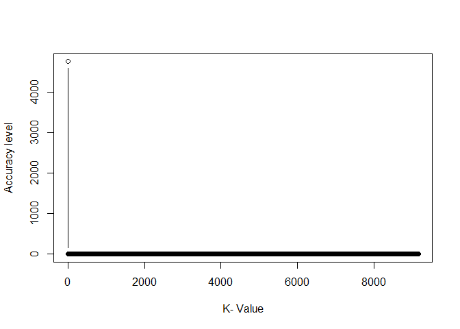

Midterm\#5
================
Tamires Amorim, Yamei Li and Meirou Guan and Carol
10/19/2020

#### KNN MODEL

``` r
load("~/R/acs2017_ny_data.RData")
```

Subset the group (narrow down the variables to predictor variables that
are significant for building the model):

Restrict the data at a minimum and maximum value (to avoid biased
outcome, since the values are different):

``` r
norm_varb <- function(X_in) {
  (X_in - min(X_in, na.rm = TRUE))/( max(X_in, na.rm = TRUE) - min(X_in, na.rm = TRUE) )
}
```

data frame

``` r
is.na(TRANWORK) <- which(TRANWORK==0)
tran_time <- TRANTIME + UHRSWORK
norm_tran_time <- norm_varb(tran_time)
fam_inc <- INCTOT
norm_fam_inc <- norm_varb(fam_inc)
```

``` r
summary(norm_tran_time)
```

    ##    Min. 1st Qu.  Median    Mean 3rd Qu.    Max. 
    ## 0.00000 0.08439 0.27426 0.24972 0.37975 1.00000

``` r
data_use_prelim_2 <- data.frame(norm_tran_time,norm_fam_inc)
good_obs_data_use <- complete.cases(data_use_prelim_2,commute_f)
dat_use <- subset(data_use_prelim_2,good_obs_data_use)
y_use <- subset(commute_f,good_obs_data_use)
```

``` r
set.seed(12345)
NN_obs <- sum(good_obs_data_use == 1)
select1 <- (runif(NN_obs) < 0.7) ## 70% trainning data
train_data_2 <- subset(dat_use,select1) ## 30% test data
test_data_2 <- subset(dat_use,(!select1))
cl_data <- y_use[select1]
true_data <- y_use[!select1]
summary(cl_data)
```

    ##    bus   rail subway    car  other 
    ##   2005    300   9552   6415   3437

``` r
prop.table(summary(cl_data))
```

    ##        bus       rail     subway        car      other 
    ## 0.09235801 0.01381915 0.44000184 0.29549956 0.15832143

``` r
summary(train_data_2)
```

    ##  norm_tran_time     norm_fam_inc     
    ##  Min.   :0.01266   Min.   :0.001011  
    ##  1st Qu.:0.25316   1st Qu.:0.021800  
    ##  Median :0.33755   Median :0.037754  
    ##  Mean   :0.34342   Mean   :0.054145  
    ##  3rd Qu.:0.42194   3rd Qu.:0.063019  
    ##  Max.   :1.00000   Max.   :1.000000

``` r
suppressMessages(require(class))
```

    ## Warning: package 'class' was built under R version 4.0.3

``` r
for (indx in seq(1, 9, by= 2)) {
 pred_commute <- knn(train_data_2, test_data_2, cl_data, k = indx, l = 0, prob = FALSE, use.all = TRUE)
num_correct_labels <- sum(pred_commute == true_data)
correct_rate <- num_correct_labels/length(true_data)
print(c(indx,correct_rate))
print(summary(pred_commute))}
```

    ## [1] 1.0000000 0.4706525
    ##    bus   rail subway    car  other 
    ##    478     79   4882   2514   1196 
    ## [1] 3.0000000 0.4892338
    ##    bus   rail subway    car  other 
    ##    327     34   5215   2406   1167 
    ## [1] 5.0000000 0.5033337
    ##    bus   rail subway    car  other 
    ##    234     21   5404   2316   1174 
    ## [1] 7.0000000 0.5134987
    ##    bus   rail subway    car  other 
    ##    173      8   5531   2279   1158 
    ## [1] 9.0000000 0.5192917
    ##    bus   rail subway    car  other 
    ##    119      4   5632   2217   1177

On the above output, I have the k-nn algorithm giving me the accuracy
for the predictions on how a person commutes to work, as I increase the
number of nearest neighbors I will get a better prediction. It also
shows the distribution of how people commute to work.

``` r
#Accuracy plot
plot((c(num_correct_labels,pred_commute)), type="b", xlab="K- Value",ylab="Accuracy level")
```

<!-- -->

<https://www.edureka.co/blog/knn-algorithm-in-r/#What%20Is%20KNN%20Algorithm>
